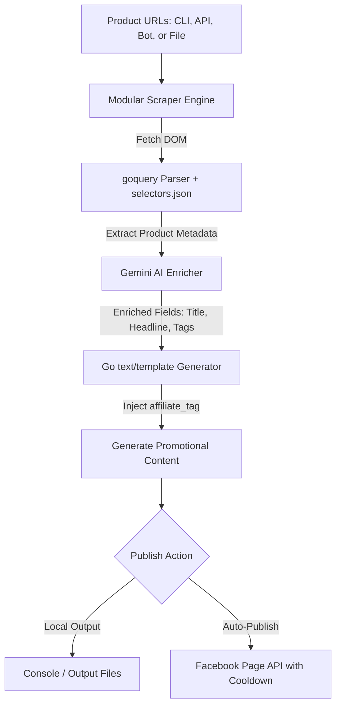

# 🚀 PostGen: Affiliate Content Generation & Auto-Publisher

[](https://golang.org)
[](https://react.dev)
[](#)
[](https://opensource.org/licenses/MIT)
[](#)

A high-performance, developer-friendly automation engine designed to scrape product listings (Amazon & more), enrich them with custom affiliate tags, generate beautiful promotional posts, and publish them directly to Facebook Pages. Complete with an interactive Vite + React web dashboard, an interactive Telegram Bot assistant, Gemini AI copy generator, PostgreSQL integration, and a highly resilient Go CLI backend.

---

## 🎨 System Overview

PostGen seamlessly merges scraping, PostgreSQL storage, Gemini AI-powered enrichment, template-driven formatting, and social publishing into a unified pipeline:



---

## ⚡ Key Features

* **🚀 High-Performance Go Core**: Native multi-threaded scraping and post-generation utilizing concurrent routines and optimized `text/template` caching.
* **🤖 Gemini-Powered AI Enrichment**: Integrates the Google Gemini (2.0 Flash) API to automatically rewrite product titles, draft punchy headlines, distill key features, compile hashtags, and construct a compelling tagline—all customized using optional per-account tone instructions.
* **📲 Interactive Telegram Bot Manager**: Fully featured interactive bot with state machine tracking. Send any Amazon URL, preview the AI-generated results for all accounts in real-time, and trigger publication (single or bulk with automatic 15-minute pacing to prevent rate limits) via inline buttons.
* **🗄️ PostgreSQL Persistence with JSON Fallback**: Modern multi-tenant data storage system storing accounts and generated data. Automatically migrates `accounts.json` profiles into the DB on first boot, and seamlessly falls back to local files if PostgreSQL is offline (dev/offline mode).
* **🎨 Modern React UI**: Interactive Vite-powered frontend featuring batch imports, live progression tracking via Server-Sent Events (SSE), and a built-in template editor.
* **📱 Integrated Facebook Auto-Poster**: Direct page publishing through the Facebook Graph API with customizable delay pacing to safely avoid rate limits.
* **🔍 Dynamic CSS Selector Engine**: Platform DOM mapping stored in a simple `selectors.json` configuration for seamless maintenance when e-commerce pages update.
* **📁 Robust File Writing Modes**: Supports **Append Mode** (combines run outputs in a single file) or **Split Mode** (creates separate sanitized files per product).
* **⚠️ Failure-Safe Execution**: Process-safe architecture ensuring an error on a single malformed URL does not crash the bulk processing pipeline.

---

## 📂 Project Structure

```text
post-gen/
├── cmd/
│   ├── cli/             # CLI application entrypoint -> go build ./cmd/cli/
│   ├── api/             # HTTP REST API server entrypoint -> go build ./cmd/api/
│   └── bot/             # Telegram Bot daemon entrypoint -> go build ./cmd/bot/
├── internal/
│   ├── core/            # Reusable engine orchestration (engine.go, types.go)
│   ├── api/             # HTTP router, middleware, handlers & SSE streams
│   ├── scraper/         # Interface-based scraping architecture (Amazon helper)
│   ├── generator/       # Template cache and renderer
│   ├── publisher/       # Facebook Graph API publisher
│   ├── config/          # accounts.json and selectors.json loaders
│   ├── db/              # PostgreSQL DB pool, migrations, and CRUD helper
│   ├── ai/              # Gemini 2.0 Flash enrichment API client
│   ├── bot/             # Interactive Telegram bot state machine and callbacks
│   ├── models/          # Shared domain models (Product, Account)
│   └── utils/           # Shared helpers (normalization, sanitization)
├── postgen-ui/          # Single Page React Application (Vite, TailwindCSS)
├── templates/           # Post templates (*.tmpl)
├── output/              # Text files generated during CLI runs
├── accounts.json        # Fallback user profiles, affiliate tags, and FB Page credentials
└── selectors.json       # CSS selectors for targeting product details
```

---

## 🛠️ Installation & Setup

### Prerequisites

* **Go**: `1.26.1` or higher
* **Node.js**: `18.x` or higher (for the frontend panel)
* **PostgreSQL**: `13` or higher (optional, falls back to `accounts.json` if unreachable)
* **Gemini API Key**: For AI-powered post enrichment
* **Telegram Bot Token**: (From [@BotFather](https://t.me/BotFather) on Telegram)

### Clone and Backend Build

1. Clone the repository:
   ```bash
   git clone https://github.com/varma322/post-gen.git
   cd post-gen
   ```

2. Compile binaries locally:
   ```powershell
   # Build the CLI application
   go build -o postgen.exe ./cmd/cli/

   # Build the REST API server
   go build -o postgen-api.exe ./cmd/api/

   # Build the Telegram Bot daemon
   go build -o postgen-bot.exe ./cmd/bot/
   ```

### Frontend Build

1. Install dependencies and compile Vite dashboard:
   ```bash
   cd postgen-ui
   npm install
   npm run build
   ```

---

## ⚙️ Configuration

### 1. Database & Environment Variables (`.env`)

Create a `.env` file in the project root to configure the PostgreSQL database, Gemini API, and Telegram Bot:

```env
# Server Port Configuration
PORT=8080
ENV=production

# Database Configuration (falls back to json if postgresql is offline)
DB_ENGINE=postgresql
DB_NAME=postgen
DB_USER=postgres
DB_PASSWORD=your_secure_password
DB_HOST=127.0.0.1
DB_PORT=5432

# Gemini API Key (for AI-powered content enrichment)
GEMINI_API="AIzaSy..."

# Telegram Bot Configurations
TELEGRAM_BOT_TOKEN="1234567890:ABCdefGhIJKlmNoPQRsTUVwxyZ"
# Comma-separated list of allowed user IDs. Leave empty to allow all users (dev mode).
TELEGRAM_ALLOWED_USER_IDS="987654321,123456789"

# Optional System Overrides
FACEBOOK_API_VERSION=v19.0
```

### 2. `accounts` Schema & `accounts.json` Fallback

Profiles represent affiliate accounts. If PostgreSQL is empty on startup, PostGen will automatically migrate the profiles from `accounts.json` in the root folder to the database.

Each account supports direct templates, Facebook credentials, and **AI-control configurations**:

* **`use_ai`** *(boolean, default true)*: Determines if this account should enrich scraped data via Gemini before rendering the template.
* **`ai_prompt`** *(string, optional)*: Instructs the AI on specific tone, style, or persona instructions for this account (e.g. "Write in a casual, emoji-heavy style for a young audience.").

Example JSON fallback template:

```json
[
  {
    "name": "afficart",
    "template_path": "templates/afficart.tmpl",
    "affiliate_tag": "afficartzone-21",
    "facebook_page_id": "104857692019482",
    "facebook_access_token": "EAAx...",
    "use_ai": true,
    "ai_prompt": "Write in a professional, benefit-focused corporate tone."
  },
  {
    "name": "smartbuy",
    "template_path": "templates/smartbuy.tmpl",
    "affiliate_tag": "smartbuy-21",
    "use_ai": true,
    "ai_prompt": "Write in a casual, emoji-heavy style for a young audience."
  }
]
```

---

## 🚀 Usage

### 🤖 Telegram Bot Mode

Run PostGen as an interactive Telegram Bot daemon to orchestrate scraping, AI enrichment, and auto-publishing right from your phone:

```powershell
.\postgen-bot.exe
```

#### Bot Setup & Workflow
1. Start the bot on Telegram by searching for your username (configured via `TELEGRAM_BOT_TOKEN`) and pressing **/start**.
2. **Send any Amazon product URL** to the bot.
3. The bot will automatically scrape the URL, run the Gemini AI enricher, and render a preview for each of your configured accounts.
4. Each preview is accompanied by an inline **`[📢 Publish [account]]`** button. Clicking this button immediately publishes the formatted post to that account's Facebook page.
5. If you have multiple accounts, you can use the **`[🚀 Publish ALL to Facebook]`** button to publish to all accounts in one click. The bot will automatically manage a **15-minute pacing delay** between posts to safely bypass Facebook API rate limits.
6. Check current status with `/status` or cancel the active session with `/cancel`.

---

### 🛠️ CLI Mode

Run post-generation workflows directly inside your console.

#### Single URL Processing
Generate a promotional post for a specific affiliate account:
```powershell
.\postgen.exe --url "https://www.amazon.in/dp/B0BYN54TM6" --account afficart
```

Generate posts for **all** accounts simultaneously:
```powershell
.\postgen.exe --url "https://www.amazon.in/dp/B0BYN54TM6" --all
```

#### 📦 Bulk File Processing
Write product URLs line-by-line into a text file (e.g. `links.txt`) and process them in a single batch:
```powershell
.\postgen.exe --file links.txt --all
```

#### ⚙️ CLI Flags Reference

| Flag | Type | Description |
| :--- | :--- | :--- |
| `--url` | `string` | Single Amazon product link to scrape |
| `--file` | `string` | Path to a text file containing one URL per line |
| `--account`| `string` | Target account name from the DB / `accounts.json` |
| `--all` | `bool` | Run generator for all configured accounts |
| `--split` | `bool` | Save each product to its own unique sanitized file |
| `--clear` | `bool` | Wipe the `/output` folder before beginning the current batch run |

---

## 🌐 API & Web Dashboard Mode

Launch the unified API + React user interface server:
```powershell
.\postgen-api.exe --addr :8080
```

Once running, navigate to `http://localhost:8080` in your web browser.

### Interactive Dashboard Features

* **⚡ Bulk Input**: Copy-paste a list of URLs directly into a textarea interface.
* **🟢 Real-Time SSE Stream**: Watch live cards populate as scraping, generation, and Facebook auto-publishing updates stream over Server-Sent Events.
* **✏️ Integrated Template Editor**: Read, edit, validate, and save your Go template layouts instantly inside the browser with built-in backup safeguards.
* **📋 Per-Result Diagnostics**: Copy completed posts with a single click, or instantly inspect any detailed failures if product details could not be retrieved.

---

## 📡 API Endpoints Reference

### 1. `GET /health`
Validates backend system integrity.
* **Response**: `{"status": "OK"}`

### 2. `GET /accounts`
Retrieves configured account profiles (reads from PostgreSQL with JSON fallback).

### 3. `POST /generate`
Generates posts synchronously with optional Gemini AI enrichment.
* **Payload**:
  ```json
  {
    "urls": ["https://www.amazon.in/dp/B0BYN54TM6"],
    "accounts": ["afficart"]
  }
  ```

### 4. `POST /generate/stream`
Establish a Server-Sent Events connection for progressive batch updates.
* **Events Emitted**: `progress`, `result`, `done`

### 5. `GET /templates`
Returns all `.tmpl` layouts stored inside `/templates` with active accounts metadata.

---

## 🐋 Docker Setup (Development & Deployment)

Quickly orchestrate and run PostGen using Docker and Docker Compose.

### Dockerfile

```dockerfile
# Build Backend
FROM golang:1.26.1-alpine AS backend-builder
WORKDIR /app
COPY go.mod go.sum ./
RUN go mod download
COPY . .
RUN CGO_ENABLED=0 GOOS=linux go build -o postgen-api ./cmd/api

# Build Frontend
FROM node:18-alpine AS frontend-builder
WORKDIR /app/postgen-ui
COPY postgen-ui/package*.json ./
RUN npm install
COPY postgen-ui/ ./
RUN npm run build

# Final Stage Image
FROM alpine:latest
WORKDIR /root/
COPY --from=backend-builder /app/postgen-api .
COPY --from=backend-builder /app/accounts.json .
COPY --from=backend-builder /app/selectors.json .
COPY --from=backend-builder /app/templates ./templates
COPY --from=frontend-builder /app/postgen-ui/dist ./web
EXPOSE 8080
CMD ["./postgen-api", "--addr", ":8080"]
```

### Run Container

```bash
# Build the image
docker build -t postgen-app .

# Start the application container
docker run -p 8080:8080 --name postgen-service postgen-app
```

---

## 📝 Roadmap

- [x] Extract CLI core business logic into reusable packages
- [x] Integrate direct Facebook Page auto-posting via Graph API
- [x] Design Vite + React control panel with real-time SSE streams
- [x] **AI-Powered Copywriter**: Gemini 2.0 Flash integration for auto-enriching posts per-account
- [x] **PostgreSQL Database Storage**: Relational DB configuration and automatic migrations on startup
- [x] **Interactive Telegram Bot Manager**: Fully-functional state machine bot supporting URL scraping, AI preview, and individual/bulk Facebook auto-publishing
- [ ] Add support for alternate e-commerce platforms (Flipkart, Myntra, etc.)
- [ ] Implement proxy rotation pool to bypass aggressive scraping blocks
- [ ] Develop analytics dashboard highlighting Facebook post engagement metrics

---

## 🤝 Contributing

Contributions make the open-source community an amazing place to learn, inspire, and create. Any contributions you make are **greatly appreciated**.

1. Fork the Project
2. Create your Feature Branch (`git checkout -b feature/AmazingFeature`)
3. Commit your Changes (`git commit -m 'Add some AmazingFeature'`)
4. Push to the Branch (`git push origin feature/AmazingFeature`)
5. Open a Pull Request

---

## 📄 License

This project is dual-licensed:
* Distributed under the **MIT License** for personal use.
* For enterprise or commercial SaaS redistribution terms, contact the project owner.

See `LICENSE` for more information.

---

## ✉️ Contact & Support

* **Project Developer**: Arun Varma
* **Repository**: [GitHub/varma322/post-gen](https://github.com/varma322/post-gen)
* **Project Status**: ACTIVE / In Development

> [!NOTE]
> Ensure your Facebook Access Tokens are set up as **Long-Lived Page Access Tokens** so they do not expire within 2 hours. Keep your credentials private and never commit `accounts.json` containing sensitive keys to source control.
