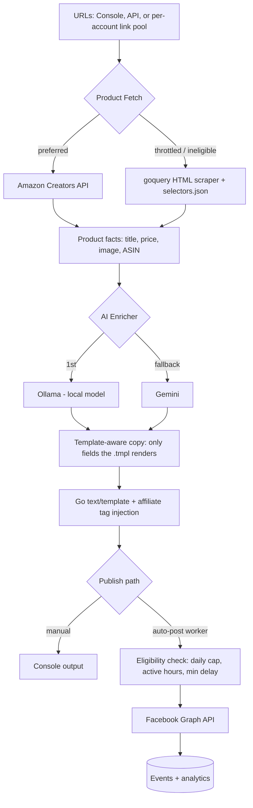

# 🚀 PostGen: Affiliate Content Generation & Auto-Publisher

[](https://golang.org)
[](https://react.dev)
[](#)
[](https://opensource.org/licenses/MIT)
[](#)

A high-performance automation engine that pulls Amazon product data (Creators API first, HTML scraper as fallback), enriches it with a local or hosted language model, renders it through per-account Go templates, and publishes it to Facebook Pages on a paced, quota-aware schedule.

It ships as a single binary — a **REST API with an embedded React ops console** — backed by PostgreSQL with a JSON fallback for offline work.

---

## 🎨 System Overview


```mermaid
graph TD
    A[URLs: Console, API, or per-account link pool] --> B{Product Fetch}
    B -->|preferred| B1[Amazon Creators API]
    B -->|throttled / ineligible| B2[goquery HTML scraper + selectors.json]
    B1 --> C[Product facts: title, price, image, ASIN]
    B2 --> C
    C --> D{AI Enricher}
    D -->|1st| D1[Ollama - local model]
    D -->|fallback| D2[Gemini]
    D1 --> E[Template-aware copy: only fields the .tmpl renders]
    D2 --> E
    E --> F[Go text/template + affiliate tag injection]
    F --> G{Publish path}
    G -->|manual| H[Console output]
    G -->|auto-post worker| I[Eligibility check: daily cap, active hours, min delay]
    I --> J[Facebook Graph API]
    J --> K[(Events + analytics)]
```

Every stage emits a trace-correlated event, so a single post can be followed end to end from the Activity Log.

---

## ⚡ Key Features

* **🛒 Dual-Path Product Fetching**: Uses the **Amazon Creators API** where the account is eligible, and falls back to the `goquery` HTML scraper on throttling (429), ineligibility, or network failure. A circuit breaker keeps a throttled partner tag off the API for a cooldown window (15 min by default, or the server's own `Retry-After`) instead of burning quota on retries.
* **🧠 Local-First AI Enrichment**: Copy is generated by a **local Ollama model** first (`qwen2.5:7b-instruct` by default), with **Gemini** as the hosted fallback when a key is configured. The provider chain is configurable at runtime from the Settings screen.
* **🎯 Template-Aware Generation**: The engine introspects each account's `.tmpl` and asks the model for **only the fields that template actually renders** — `dealsvault.tmpl` renders a title alone, so nothing else is requested. Prices, discounts, and affiliate links are never model-written; they stay facts from the fetch.
* **📊 Quota-Aware Auto-Publisher**: A background worker drains publication jobs against per-account rules — daily post cap, active-hours window (including overnight ranges), and minimum rest between posts. Blocks are classed as retryable (outside window, delay not met) or terminal for the day (cap reached).
* **⏱️ Recurring Schedules**: Named `interval` or `daily` triggers fire the auto-post pipeline on their own. Missed windows are not replayed — catching up would fire exactly the burst that pacing exists to prevent.
* **🔗 Per-Account Link Pools**: Each account has a dedicated pool of URLs the pipeline prefers before falling back to the shared product queue, with optional rotation of already-posted links when a pool runs dry.
* **📈 Analytics & Event Log**: Summary and per-channel analytics over a rolling window — publish volume with period-over-period deltas, queue health, AI success rate by provider, scrape success and HTML-fallback rate. Every pipeline event is stored with a trace ID, level, source, duration, and metadata.
* **🖥️ PostGen V2 Console**: A ten-screen React 19 operations console — Dashboard, Publisher, Channels, Analytics, Content Queue, Scheduler, Activity Log, Templates, Accounts, Settings — compiled into the Go binary, so the server is a single file.
* **🗄️ PostgreSQL with JSON Fallback**: Nine migrated tables covering accounts, link pools, queue, jobs, job items, published posts, events, schedules, and settings. `accounts.json` is migrated in on first boot, and the whole app degrades to local files when PostgreSQL is unreachable.
* **🔐 Bearer Token Auth**: All routes except `/health` sit behind a token when one is configured.

---

## 📂 Project Structure

```text
post-gen/
├── cmd/
│   └── api/             # API + console entrypoint  -> go build ./cmd/api/
├── internal/
│   ├── core/            # Engine, background worker, schedules, settings, analytics
│   ├── api/             # Router, middleware, handlers, SSE, analytics/schedules/settings
│   ├── scraper/         # Creators API client + circuit breaker, HTML scraper, throttling
│   ├── ai/              # Provider chain (Ollama, Gemini), template introspection, price guards
│   ├── generator/       # Template cache, renderer, money formatting, introspection
│   ├── publisher/       # Facebook Graph API publisher
│   ├── events/          # Buffered, trace-correlated event emitter
│   ├── db/              # Pool, migrations, CRUD, analytics/schedules/settings queries
│   ├── config/          # accounts.json and selectors.json loaders
│   ├── models/          # Domain models (Product, Account, Job, Event, Schedule, Settings…)
│   └── utils/           # URL normalization, affiliate tagging, sanitization
├── postgen-ui/          # React 19 + Vite + Tailwind SPA (builds into ../web)
├── web/                 # Built SPA assets, embedded into the API binary via go:embed
├── templates/           # Per-account post templates (*.tmpl)
├── accounts.json        # Fallback account profiles (migrated into PostgreSQL on boot)
├── selectors.json       # CSS selectors for the HTML scraper
└── build.ps1            # Builds the UI, then the API binary, into dist/
```

---

## 🛠️ Installation & Setup

### Prerequisites

* **Go**: `1.26.1` or higher
* **Node.js**: `18.x` or higher (to build the console)
* **PostgreSQL**: `13` or higher — optional; the app falls back to `accounts.json` when unreachable, but the auto-post worker, schedules, events, and analytics all require it
* **Ollama**: optional but recommended, for local AI enrichment
* **Gemini API Key**: optional, used as the hosted enrichment fallback
* **Amazon Creators API credentials**: optional; without them every fetch uses the HTML scraper

### Clone and Build

```bash
git clone https://github.com/varma322/post-gen.git
cd post-gen
```

**One-shot build (recommended)** — builds the React console and the API binary into `dist/`:

```powershell
.\build.ps1                                  # defaults: -Output dist -Version v2.5.5
.\dist\postgen-api_v2.5.5.exe --addr :8088
```

**Manual build**:

```powershell
# 1. Build the console. Vite writes into ../web, which the Go binary embeds.
cd postgen-ui
npm install
npm run build
cd ..

# 2. Build the binaries
go build -o postgen-api.exe ./cmd/api/    # REST API + console
```

> [!IMPORTANT]
> `web/` is compiled into the API binary with `go:embed`. Rebuild the frontend **before** the Go binary, or the server will serve the previous console build.

### Frontend Development

`npm run dev` proxies every API route to `http://localhost:8088`, so run the API binary alongside it for live reload against real data.

### Tests

```bash
go test ./...
```

---

## ⚙️ Configuration

### 1. Environment Variables (`.env`)

`.env` is loaded from the working directory at startup and is optional — system environment variables work just as well.

```env
# --- API Server ---
POSTGEN_API_TOKEN="your-bearer-token"   # empty = auth disabled (a startup warning is logged)

# --- PostgreSQL (falls back to accounts.json when unreachable) ---
DB_HOST=127.0.0.1
DB_PORT=5432
DB_USER=postgres
DB_PASSWORD=your_secure_password
DB_NAME=postgen

# --- AI enrichment: Ollama is tried first, Gemini second ---
OLLAMA_HOST=http://127.0.0.1:11434
OLLAMA_MODEL=qwen2.5:7b-instruct
OLLAMA_TIMEOUT=45s
GEMINI_API="AIzaSy..."
GEMINI_MODEL=gemini-3.5-flash

# --- Amazon Creators API (omit to always use the HTML scraper) ---
AMAZON_CREATOR_CLIENT_ID="amzn1.application-oa2-client..."
AMAZON_CREATOR_CLIENT_SECRET="..."
AMAZON_CREATOR_PARTNER_TAG="yourtag-21"
AMAZON_CREATOR_TOKEN_URL="https://api.amazon.com/auth/o2/token"

# --- Affiliate tagging ---
DEFAULT_AFFILIATE_TAG=yourtag-21        # used when an account sets none

# --- Facebook ---
FACEBOOK_API_VERSION=v19.0
```

> [!NOTE]
> Values saved from the **Settings** screen live in the `settings` table and **override the matching environment variable**. Anything unset there falls back to the environment, then to a built-in default. The Settings API reports the source of each value (`database`, `environment`, or `default`), and never returns secrets — only whether one is configured.

### 2. Account Configuration

Accounts can be managed from the Accounts screen or the `/accounts` API; `accounts.json` is the offline fallback and the source for the first-boot migration.

| Field | Type | Purpose |
| :--- | :--- | :--- |
| `name` | string | Unique account identifier |
| `template_path` | string | Path to this account's `.tmpl` |
| `affiliate_tag` | string | Injected into every product link |
| `facebook_page_id` | string | Target Facebook Page |
| `facebook_access_token` | string | Long-lived Page access token |
| `use_ai` | bool | Enrich via the AI chain before rendering (default `true`) |
| `ai_prompt` | string | Per-account tone/persona instruction |
| `active` | bool | Participates in auto-post selection (absent = active) |
| `max_posts_per_day` | int | Daily publish cap; `0` = unlimited |
| `active_hours_start` / `active_hours_end` | `HH:MM` | Posting window; start after end means overnight |
| `min_delay_minutes` | int | Minimum rest between consecutive posts |

```json
[
  {
    "name": "afficart",
    "template_path": "templates/afficart.tmpl",
    "affiliate_tag": "afficartzone-21",
    "facebook_page_id": "104857692019482",
    "facebook_access_token": "EAAx...",
    "use_ai": true,
    "ai_prompt": "Write in a professional, benefit-focused corporate tone.",
    "active": true,
    "max_posts_per_day": 6,
    "active_hours_start": "09:00",
    "active_hours_end": "21:00",
    "min_delay_minutes": 90
  }
]
```

---

## 🚀 Usage

### 🌐 API + Console Mode

```powershell
.\postgen-api.exe --addr :8088 --api-token "your-bearer-token"
```

Then open `http://localhost:8088`. The background auto-post worker starts automatically when PostgreSQL is connected (15-minute cooldown by default, adjustable in Settings).

#### Console Screens

| Screen | What it does |
| :--- | :--- |
| **Dashboard** | Live pipeline state, worker status, recent activity, headline metrics |
| **Publisher** | Compose and publish with quota-aware channel selection — ineligible channels are shown with the reason |
| **Channels** | Per-account performance cards and configuration |
| **Analytics** | Publish trends with deltas, queue health, AI provider outcomes, scrape/fallback rates |
| **Content Queue** | Shared product queue and per-account link pools, with queue counts kept distinct from in-flight pipeline counts |
| **Scheduler** | Create, pause, edit, and manually run interval/daily schedules |
| **Activity Log** | Filterable event stream (level, source, account, type, free-text, time) with trace drill-down |
| **Templates** | Read, edit, validate, and save `.tmpl` layouts, with backups |
| **Accounts** | Full account CRUD including rate limits and active hours |
| **Settings** | AI provider order and models, system prompt, Graph API version, partner tag, worker cooldown, debug logging |

---

## 📡 API Reference

All routes except `GET /health` require `Authorization: Bearer <token>` when a token is configured. Request bodies are size-limited.

### System

| Method | Route | Description |
| :--- | :--- | :--- |
| `GET` | `/health` | Status, DB connectivity, active job, dropped-event count, circuit breaker state |
| `GET` | `/stats` | Recent published-post statistics |
| `GET` | `/worker/status` | Worker phase (`idle`/`scraping`/`enriching`/`publishing`/`cooldown`), current account/URL/job, cooldown |
| `GET` / `PUT` | `/settings` | Read effective settings with per-field source; write partial updates (omitted keys stay unchanged) |

### Generation & Publishing

| Method | Route | Description |
| :--- | :--- | :--- |
| `POST` | `/generate` | Synchronous generation. Body: `{ "urls": [...], "accounts": [...], "publish": false, "publish_delay_minutes": 15 }` |
| `POST` | `/generate/stream` | Same payload over SSE. Events: `progress`, `result`, `done` |
| `POST` | `/generate/link` | Convert a URL into a tagged affiliate link. Body: `{ "url": "...", "tag": "..." }` |
| `POST` | `/publish` | Publish prepared copy. Body: `{ "account": "...", "content": "..." }`. Returns `409` when the account's daily cap is already reached |

### Accounts & Link Pools

| Method | Route | Description |
| :--- | :--- | :--- |
| `GET` / `POST` | `/accounts` | List or create accounts |
| `PUT` / `DELETE` | `/accounts/{name}` | Update or delete an account |
| `GET` / `POST` | `/accounts/{name}/links` | List or add URLs in that account's dedicated pool |
| `DELETE` | `/accounts/{name}/links/{id}` | Remove one pooled link |

### Queue & Jobs

| Method | Route | Description |
| :--- | :--- | :--- |
| `GET` / `POST` | `/products` | List the shared queue, or queue a URL |
| `DELETE` | `/products/{id}` | Remove a queued product |
| `POST` | `/jobs` | Trigger an auto-post job. Optional body: `{ "rotate_old_links": true }` |
| `GET` | `/jobs/active` | The in-flight job and its items, or `{"active": false}` |
| `POST` | `/jobs/cancel` | Cancel all active jobs |

### Schedules

| Method | Route | Description |
| :--- | :--- | :--- |
| `GET` / `POST` | `/schedules` | List or create schedules (`interval` with `interval_minutes`, or `daily` with `daily_at` as `HH:MM`) |
| `PUT` / `DELETE` | `/schedules/{id}` | Update or delete a schedule |
| `POST` | `/schedules/{id}/run` | Fire a schedule immediately |

### Events & Analytics

| Method | Route | Description |
| :--- | :--- | :--- |
| `GET` | `/events` | Query the event log. Params: `level`, `source`, `account`, `type`, `q`, `since` (RFC3339), `limit` |
| `GET` | `/events/{traceID}` | Every event for one pipeline run, in order |
| `GET` | `/analytics/summary` | Rolling-window totals, deltas, queue health, AI and scraper stats. Param: `days` |
| `GET` | `/analytics/channels` | Per-account performance rows. Param: `days` |

### Templates

| Method | Route | Description |
| :--- | :--- | :--- |
| `GET` | `/templates` | All `.tmpl` layouts with the accounts using each |
| `GET` / `PUT` | `/templates/{name}` | Read or overwrite one template's content |

---

## 🐋 Docker

No `Dockerfile` is committed. The following builds a single self-contained image — note that the frontend stage must run first, because its output is embedded into the Go binary rather than copied beside it.

```dockerfile
# Stage 1: build the console into web/
FROM node:18-alpine AS frontend
WORKDIR /app
COPY postgen-ui/package*.json ./postgen-ui/
RUN cd postgen-ui && npm install
COPY . .
RUN cd postgen-ui && npm run build

# Stage 2: build the API binary with web/ embedded
FROM golang:1.26.1-alpine AS backend
WORKDIR /app
COPY --from=frontend /app ./
RUN go mod download && CGO_ENABLED=0 GOOS=linux go build -o postgen-api ./cmd/api

# Stage 3: runtime
FROM alpine:latest
WORKDIR /app
COPY --from=backend /app/postgen-api .
COPY --from=backend /app/accounts.json .
COPY --from=backend /app/selectors.json .
COPY --from=backend /app/templates ./templates
EXPOSE 8088
CMD ["./postgen-api", "--addr", ":8088"]
```

```bash
docker build -t postgen-app .
docker run -p 8088:8088 --env-file .env --name postgen-service postgen-app
```

---

## 📝 Roadmap

- [x] Extract CLI core business logic into reusable packages
- [x] Facebook Page auto-posting via the Graph API
- [x] React control panel with real-time SSE streams
- [x] AI-powered copywriter with per-account tone control
- [x] PostgreSQL storage with automatic migrations and JSON fallback
- [x] Amazon Creators API with circuit-breaking HTML fallback
- [x] Local-model (Ollama) enrichment with hosted fallback and template-aware schemas
- [x] Per-account rate limits, active hours, and daily publish caps
- [x] Per-account dedicated link pools with rotation on exhaustion
- [x] Trace-correlated pipeline event log
- [x] Recurring interval and daily schedules
- [x] Analytics dashboard: publish trends, queue health, AI and scraper success rates
- [ ] Alternate e-commerce platforms (Flipkart, Myntra, etc.)
- [ ] Proxy rotation pool to survive aggressive scraping blocks
- [ ] Facebook post engagement metrics pulled back into Analytics

---

## 🤝 Contributing

1. Fork the project
2. Create your feature branch (`git checkout -b feature/AmazingFeature`)
3. Commit your changes (`git commit -m 'Add some AmazingFeature'`)
4. Push to the branch (`git push origin feature/AmazingFeature`)
5. Open a pull request

Run `go test ./...` before opening a PR, and rebuild `web/` if you touched `postgen-ui/`.

---

## 📄 License

This project is dual-licensed:
* Distributed under the **MIT License** for personal use.
* For enterprise or commercial SaaS redistribution terms, contact the project owner.

See `LICENSE` for more information.

---

## ✉️ Contact & Support

* **Project Developer**: Arun Varma
* **Repository**: [GitHub/varma322/post-gen](https://github.com/varma322/post-gen)
* **Project Status**: ACTIVE / In Development

> [!WARNING]
> Use **long-lived Page access tokens** so publishing does not break after two hours. Never commit a populated `accounts.json` or `.env` — both hold live credentials.
