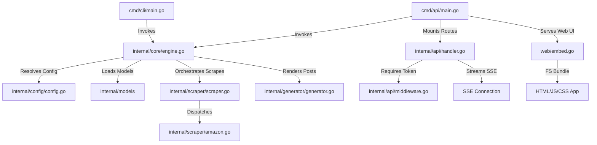
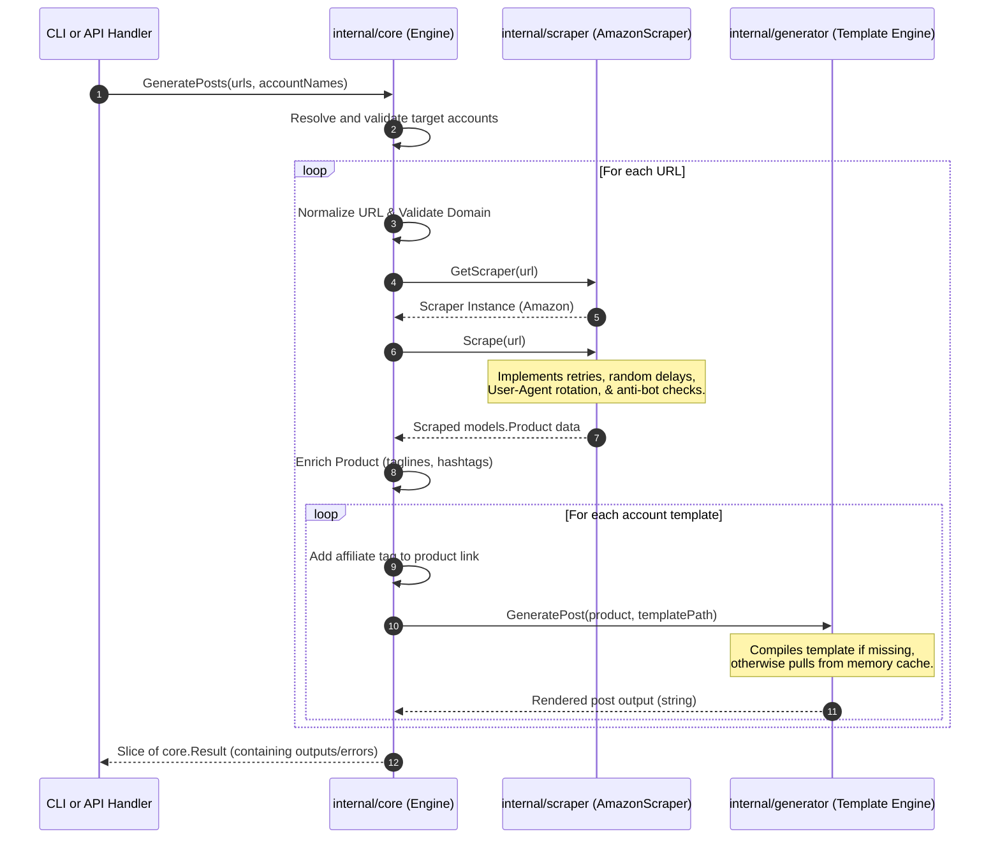
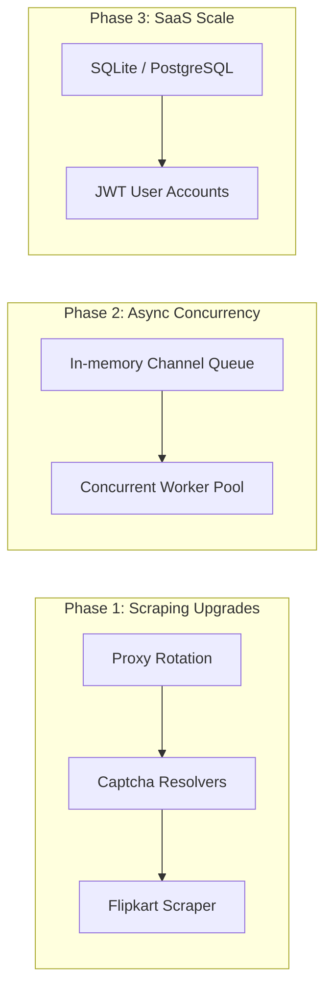

# Project Analysis Report: Affiliate Content Generation Engine (`postgen`)

This report provides a comprehensive, professional, and detailed architectural analysis of the **PostGen** project—a high-performance, CLI-driven, and web-accessible affiliate content generation tool built with Go.

---

## 📊 Executive Summary

The **PostGen** project is a robust, modular utility designed to automate the process of scraping product details from e-commerce product pages (primarily Amazon) and rendering them into highly customizable affiliate promotional posts. Originally developed as a command-line interface (CLI) tool, it has recently been refactored into a dual-purpose system that includes a high-performance **HTTP API server** and an embedded **Single Page Application (SPA) Web UI**.

### 🌟 Key Product Achievements
* **Decoupled Architecture**: Clean division between the command-line entrypoint, API server, reusable core engine, custom scrapers, and generator packages.
* **Fail-Safe Scraping Engine**: Incorporates robust anti-bot bypass strategies, random delays, random User-Agents, automatic retry mechanisms (with classification for hard blocks and rate limits), and out-of-stock detection.
* **High-Performance Rendering**: Go's native `text/template` engine with an in-memory caching layer to eliminate redundant disk read actions.
* **Real-time Streaming (SSE)**: The API supports server-sent progress and result streaming, enabling smooth, non-blocking bulk operations in the browser.
* **Template Manager Panel**: An integrated UI interface allows live editing and syntax validation of template files directly within the browser, backed up automatically before saves.
* **Production-Ready Security**: Bearer Token middleware provides secure token authorization on public-facing networks.
* **Excellent Test Coverage**: High-quality unit and integration test suites covering the core orchestrator, API handlers, scraper features, and helpers.

---

## 🏗️ Architecture & Component Design

The project is structured according to clean architecture principles, making components easily testable, replaceable, and extensible. Below is the dependency and communication structure of the system:



### Directory Structure & File Roles

```text
postgen/
├── cmd/
│   ├── cli/             # CLI binary entrypoint (main.go)
│   └── api/             # Dedicated API server entrypoint (main.go)
├── internal/
│   ├── core/            # Reusable engine orchestrator (engine.go, types.go)
│   ├── api/             # HTTP router, handlers, middleware & tests
│   ├── scraper/         # Extensible scraping interface & Amazon implementation
│   ├── generator/       # Template compilation, rendering, and caching
│   ├── config/          # accounts.json and selectors.json loading utilities
│   ├── models/          # Shared database-independent structs (Product, Account)
│   └── utils/           # Shared string formatting & URL normalizers
├── web/                 # Embedded Single Page Application frontend (HTML/JS/CSS)
├── templates/           # Raw Go text template assets (.tmpl)
└── output/              # Local file-generation output repository
```

---

## 🔍 Core Pipeline Walkthrough

At the heart of `postgen` is a unified scrape-and-render pipeline. When given an input URL list and account names, it performs the following sequential actions:



---

## 🛠️ Detailed Component Analysis

### 1. Reusable Core Orchestrator (`internal/core`)
The core orchestrator (`engine.go`) maps e-commerce URLs to platform-specific scraper instances and merges the raw details with custom account templates.
* **Separation of Concerns**: File output is excluded from the core engine. The core engine is pure in-memory business logic. The `cli` handles the writing of files, and the `api` handles JSON/SSE responses.
* **Product Enrichment**: Automatically infers default tags and hashtags if they are missing from scraped data, maintaining output formatting even with minimal template declarations.

### 2. Extensible Scraping Engine (`internal/scraper`)
The scraper uses an interface-based design allowing simple integration of additional platforms (e.g. Flipkart, eBay) without modifying core coordination files.
* **Anti-Blocking Techniques**:
  * **User-Agent Rotation**: Dynamically swaps out standard browser request headers for each HTTP request to avoid basic signature checks.
  * **Randomized Backoff Delays**: Employs millisecond delays simulating human navigation before scrapers run.
  * **Error Classification**:
    * **HTTP 403**: Recognized as a hard bot block, immediately terminating retries to prevent IP reputation damage.
    * **HTTP 429**: Classified as a rate-limiting event, triggering a long progressive backoff delay (10-20 seconds) before repeating.
    * **Network Timeout**: Retries immediately up to 3 times with short sequential delays (2-4 seconds).
* **OutOfStock Detection**: Scrapes common availability tags to identify unavailable inventory. Instead of failing the run, it registers the product's price as "Out of stock" so templates can render appropriately.
* **Captcha Identification**: Prevents parsing of garbled data by checking for Amazon's validation forms, returning a clear error if captcha walls are hit.

### 3. High-Performance Template Engine (`internal/generator`)
Leverages standard library `text/template` capabilities to parse template files safely.
* **In-Memory Cache**: Uses a standard map wrapped in a `sync.RWMutex`. The engine compiles a template only once upon first use and stores it. Subsequent rendering requests hit the RAM cache, achieving near-instant results.
* **Thread Safety**: The read-write lock protects simultaneous API calls from corrupting the internal cache map.
* **Cache Invalidation**: Provides an `InvalidateCache` method. When templates are modified via the API, the old version is instantly ejected from memory, forcing a fresh compile on the next request.

### 4. API, Security & Streaming Layer (`internal/api`)
Exposes endpoints to retrieve account lists, update templates, and stream generation cycles.
* **Server-Sent Events (SSE)**: For long-running bulk scraping batches, standard HTTP request-response patterns would timeout. `/generate/stream` addresses this by utilizing standard HTTP flushers, streaming JSON events over a persistent connection:
  * `progress`: Yields live indicators like `Processing 3/10: https://...`.
  * `result`: Returns individual card results immediately upon compilation without waiting for the full batch.
  * `done`: Summarizes overall run metrics (Total, Success, Failed).
* **Robust Input Validation**: Rejects empty inputs, validates JSON formats, ensures path parameters are safe against directory traversal (`..`), and checks that all requested templates compile correctly before saving them.
* **Bearer Token Authorization**: Leverages custom lightweight middleware protecting high-impact routes (such as generation and template edits). The token is parsed from incoming headers. Public files (Web UI, styles) remain accessible so the browser can serve the configuration page first.

### 5. Browser Single Page Application (`web`)
Built as a responsive, zero-dependency SPA written in modern Vanilla HTML, CSS, and JS, bundled natively into the Go binary.
* **Rich Aesthetics**: Custom gradients, modern glassmorphism panels, harmonious success/danger badge colors, sleek card layouts, and dynamic micro-animations.
* **Template Editor Integration**: Direct management console containing a template selection dropdown, dynamic reloads, live validation, and single-click saves.
* **Copy-to-Clipboard**: Embeds a copy button on all successful result cards, automatically giving visual feedback upon copy success.
* **Token Retention**: Saves security tokens locally inside browser standard `localStorage`, preserving login context across sessions.

---

## 🧪 Testing Suite & Robustness

The test suite is highly professional, thorough, and robust. It passes **100% successfully** across all components.

```text
ok  	post-gen/internal/api       0.629s (API routes, Bearer Token Auth, SSE streams, TempDirs)
ok  	post-gen/internal/core      0.791s (Engine configuration, URL normalizers, stub scrapers)
ok  	post-gen/internal/scraper   0.470s (Scraping handlers, out-of-stock, CAPTCHA checks)
ok  	post-gen/internal/utils     0.763s (Slugification, URL parameters, query tag injection)
```

### Crucial Security and Integration Tests Covered
1. **Directory Traversal Defense**: Verifies that requests containing `%2e%2e%2f` (`../`) are detected and blocked at the API layer.
2. **Invalid Template Rejections**: Assures that malformed templates (e.g. unclosed tags like `{{if .Title}}` with no `{{end}}`) are rejected before disk changes apply.
3. **Backup Guarantee**: Confirms that when modifying a template, the API creates a `.bak-[timestamp]` file containing the original template state prior to writing new edits.
4. **Auth Enforcement**: Validates correct bearer tokens, rejects invalid ones, and bypasses health/frontend routes as intended.
5. **Partial Batch Resilience**: Table-driven tests guarantee that if one URL fails in a batch, it returns an error result for that URL *without* terminating the other successful generation tasks.

---

## 🚀 Strengths, Technical Debt & Recommendations

### 🌟 Architectural Strengths
1. **Dependency Minimization**: The API server runs entirely on Go's standard library `net/http` package. It uses zero major framing dependencies (like Gin, Fiber, or Echo), making the compiled binary extremely tiny, fast, and secure.
2. **Zero-Configuration UI**: Since the frontend SPA files are embedded inside the Go executable using `go:embed`, the application requires zero external web server setups (no Node, Nginx, or Webpack configurations are required in production).
3. **High-Performance Rendering**: Cache mechanisms bypass disk I/O, ensuring massive speedups for recurring templates.

### ⚠️ Technical Debt & Identified Limits
1. **Blocking Single-Threaded Worker Loop**: In both CLI and API streams, URLs are processed sequentially. A single lagging URL will stall progress for other tasks in the queue.
2. **In-Memory Configuration Persistence**: Accounts are stored in a file (`accounts.json`) and templates on disk (`/templates`). There is no relational database, meaning users cannot dynamically add new accounts through the UI.
3. **Single Platform Scraper**: Currently, only Amazon scraping is implemented.

### 🔮 Recommendations for Scaling

To evolve `postgen` from an MVP to a high-scale SaaS production system, we recommend implementing the following phases:



#### 📶 Short-Term (Scraping & Concurrency Improvements)
* **Concurrent Worker Pool**: Transition from sequential processing to concurrent workers. Distribute URLs across Go channels, allowing multiple scrapes to execute in parallel, substantially accelerating bulk operations.
* **Flipkart Selector Integration**: Expand `selectors.json` to support Flipkart CSS selectors. Create `FlipkartScraper` in `internal/scraper` and register it in `scraper.go`.
* **Proxy and Captcha Resolver Integration**: To avoid bot detection during high bulk runs, integrate rotating proxy support inside `getHttpClient()`. Add hook connections to CAPTCHA solving APIs (like 2Captcha) when CAPTCHA forms are identified.

#### 🏛️ Long-Term (Database & User Management Integration)
* **Database Migration**: Move `accounts.json` and template paths into a lightweight SQLite or PostgreSQL database. Expose new endpoints (`POST /accounts`, `DELETE /accounts`) to allow full CRUD of affiliate accounts via the UI.
* **User Accounts & Teams**: Extend the Bearer Token middleware into a JWT authentication system with proper signup, login, and user roles. Associate templates and accounts with specific user IDs so multiple creators can securely share the platform.
